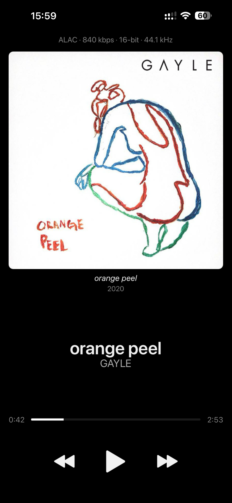
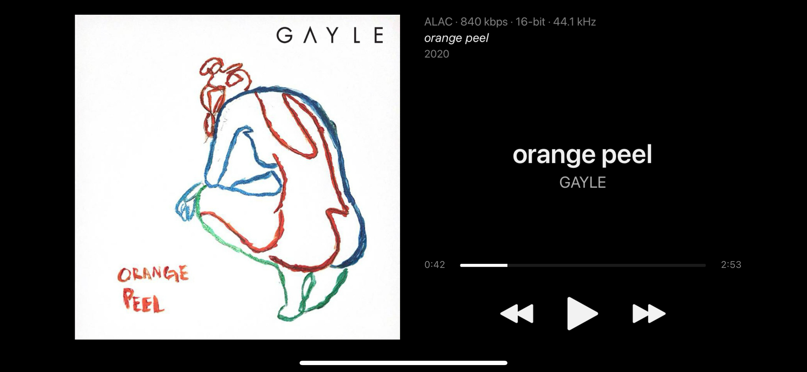

# Minimal — a skin for foobar2000 mobile

A quiet now-playing screen: the full format line where you can actually read it,
a large cover, the album and its release date, title and artist, a seekbar that
tells you what's left, and three buttons.




More in [`screenshots/`](screenshots) — the square-corner variant, and a track
with no embedded artwork.

> Screenshots are from 2.0.0. The layout is the same in 2.1.0; on a notch or
> Dynamic Island phone the top block now starts lower down.

Built on **[NewMoon 2.0](#attribution)** by TAOKA-Daiki. What's original here is
the layout, the format line, and the generator that produces every canvas.

---

## Install

1. Download `Minimal-r2.1.0.fbskin` (rounded artwork corners) or
   `Minimal-s2.1.0.fbskin` (square) from [Releases](../../releases).
2. Open it on your device and let foobar2000 mobile import it, or drop it into
   foobar's Skins folder via the Files app.
3. foobar2000 mobile → Settings → Skin → **Minimal**.

`Minimal-r-plain2.1.0.fbskin` / `Minimal-s-plain2.1.0.fbskin` are the same skin
without the format line — just album, release date, title and artist. Install
either, or both; they show up under separate names.

Skin format 2, so it needs a foobar2000 mobile version that supports it (v1.5 or
newer). Both normal and status-bar-hidden canvases ship, so it works either way.

---

## What it changes

- **Full format line** — `ALAC · 840 kbps · 16-bit · 44.1 kHz`, at a readable
  size: above the art in portrait, beside it in landscape
- **Large album art**, with the album (italic) and its release date under it
- **Title and artist**, centred
- **Seekbar with elapsed left, remaining right**, on the same row
- **Transport only** — prev / play / next. Shuffle, repeat and next-track are gone
- **Nothing behind the camera** — every canvas is inset clear of the notch or
  Dynamic Island, the home indicator, and the landscape side insets
- No position dot, no clipped text

---

## 2.1.0

- **Nothing under the front camera.** The format line used to sit 6–21 pt from
  the top of the screen, which on a Dynamic Island phone is straight behind the
  housing — and the cover's top edge was under it as well. The top block now
  starts below the safe-area inset, and the transport clears the home indicator.
  Pre-notch and status-bar-hidden canvases are untouched — byte-identical to
  2.0.0, which was confirmed on device.
- **Release dates work.** Two separate bugs: `$year()` turned a slash-formatted
  tag into `0000`, and the fix for that then printed `?` on untagged tracks.
  Both covered in [the note below](#the-release-date-year-and-). Dates now show
  exactly as tagged, `07/17/2020` and all, and untagged tracks show nothing.
- **Landscape safe areas.** The iPhone 17 reports top and bottom insets in
  landscape where the 16 and earlier reported `T:0` — so the sides are no longer
  enough on their own.
- **iPhone 17 / 17 Pro / Air / 16 Pro / 15 Pro** get their own canvas
  (9:19.57) instead of borrowing the 9:19.5 one.

---

## Device coverage

Twenty-one canvases, registered by aspect ratio rather than by device, so a phone
that finds a NewMoon canvas finds a Minimal one too:

- **Portrait** 9:16, 9:18, 9:19.5, 9:19.57, 9:20, 9:21, 9:22 · status-bar-hidden
  9:16 and 9:19.5 · tablet 12:16, 12:18
- **Landscape** 16:9, 17:9, 19.5:9, 19.57:9, 20:9, 21:9, 22:9, 23:9 · tablet
  16:12, 18:12

9:19.57 is the 402×874 pt iPhones — 17, 17 Pro, Air, 16 Pro, 15 Pro. They're 0.4%
off 9:19.5 and were already landing on it and rendering fine; the exact entry just
stops the layout being stretched to fit.

If your device lands on something unlisted, open an issue with the model and the
display info from **Tools → Console**, and it's a one-line addition.

---

## Build from source

```bash
python gen_format2.py
```

Produces both variants from `NewMoon2.0_unpacked/` (assets and LICENSE come from
it). `--source` points elsewhere if you keep it somewhere else. Add `--no-codec`
for the pair without the format line:

```bash
python gen_format2.py --no-codec
```

**`assets/` wins over the source package.** Three seekbar images are ours, not
NewMoon's — a plain **white** played-bar and a **fully transparent** marker (no
dot). NewMoon ships a rainbow `dawn` gradient and a visible marker under the same
filenames, so a build that takes everything from the source package comes out
with a dotted, multicoloured timeline. Keep those three in `assets/`.

### How the layouts are generated

`gen_format2.py` holds the design once and emits all 19 canvases from it.

- **Sizes scale with width** (the cover has to stay square and fit), and the
  leftover height splits evenly into the two breathing gaps — above the title and
  above the seekbar.
- **Island-class canvases get safe-area margins.** Only the tall aspect ratios
  (≥ 2.05) — the 9:16 and 9:18 canvases are pre-notch phones, the
  status-bar-hidden ones already exclude the chrome, and tablets have neither an
  island nor a home indicator, so padding those would only waste screen. See
  [safe areas](#safe-areas-the-canvas-is-the-whole-screen) for where the numbers
  come from.
- **Landscape** puts a square, vertically centred cover on the left with an info
  column to its right. The cover is height-driven but **also capped by width** —
  on a squarish tablet canvas (16:12) a full-height square swallows the row and
  pushes the transport buttons off the right edge. It's inset from the left by the
  same margin it has above and below, so the rounded corners have black to round
  against.
- **The codec/album/year block is anchored to the cover top**, flush with it, so
  it stays with the cover when the width cap moves it.

---

## Notes for anyone writing a format-2 skin

Not documented anywhere I could find, and each one cost me time:

- **A `.fbskin` is a plain ZIP** with **one** top-level folder named after the
  skin. No custom container tool — just `zip`/`unzip`.
- **Every text file is UTF-16** (LE, with BOM). Write UTF-8 and foobar silently
  ignores the file; the skin loads looking like it did nothing.
- The definition file is **`skindef.txt`** and must declare **`skin-format: 2`**.
- Canvases are registered **per aspect ratio at a canonical width**
  (`skin: 1125x2500 portrait-9-20-1125x2500.txt`), not per device. Tablet entries
  take a `-tablet` suffix on the size key.
- Colours come from named font keys (`[font-info]`, `[font-artist]`) defined in
  `skindef.txt`, rather than format 1's inline `[rgb-r-g-b]`.
- **Format 2 seats label text lower inside the same box than format 1 did.** If
  you're porting a hand-tuned format-1 layout, reproducing its coordinates isn't
  enough — trust your eyes over the numbers.
### Safe areas: the canvas is the whole screen

foobar does not inset the canvas for the camera housing and does not expose the
safe area to the skin, so clearance is yours to hard-code. Two things make that
harder than it sounds.

**Work in Apple's published safe-area insets, not the pill's dimensions.** The
inset already accounts for the housing plus its breathing room, and it's the
number Apple actually guarantees. For the current phones:

| Model | Points | Portrait | Landscape |
|---|---|---|---|
| iPhone 17 / 17 Pro | 402×874 | T 62, B 34 | T 20, B 20, L/R 62 |
| iPhone 17 Pro Max | 440×956 | T 62, B 34 | T 20, B 20, L/R 62 |
| iPhone Air | 420×912 | **T 68**, B 34 | T 20, **B 29**, L/R **68** |
| iPhone 16 / 15 / 14 | 393×852 | T 59, B 34 | T 0, B 21, L/R 59 |
| iPhone X / XS / 11 Pro | 375×812 | T 44, B 34 | T 0, B 21, L/R 44 |

Landscape gained top and bottom insets with the iPhone 17 — 16 and earlier report
`T:0` there — so a skin that only insets the sides was correct for exactly one
generation.

**A canvas is shared by every device of its aspect ratio, so you need the worst
case, and the worst case is in units, not points.** One canvas unit is the short
axis over 1125, so `units = pt × 1125/short_pt` — which means the phone with the
largest inset in points isn't necessarily the one that needs the most units. The
iPhone Air's 68 pt over a 420 pt short side is 182 units; the Pro Max's 62 pt over
440 pt is only 158. Take the max over the whole device list and round up.

The generator does that arithmetic in a comment block next to the constants, so
adding a device means adding a row and re-checking the max.

### The release date, `$year()`, and `?`

Two traps, one after the other.

`$year()` only reads a **leading** four-digit year. Hand it a slash-formatted
tag — `07/17/2020`, which is how plenty of people date a library — and it reads
`07/1`, fails, and hands back `0000`, which sails straight onto the screen as
the release year.

Printing the tag verbatim fixes that, but `$if2(%date%,%year%)` then shows a
literal `?` on an untagged track: **foobar renders an undefined field as `?`**,
and `$if2`'s fallback leaves `%year%` sitting in the *output* position. The
fields are still tested as falsy correctly — what's missing is an empty branch
for the output to land in. `$if3` takes a trailing empty argument, which is how
NewMoon writes the same guard:

```
$if3(%date%,%year%,)
```

`%date%` comes first deliberately: if foobar derives `%year%` through that same
parser then `%year%` is *itself* `0000` for a slash-formatted tag, and `$if2`
would have taken it. Reading the raw tag first can't lose that way, and it keeps
the month and day rather than throwing them out. A release tagged `2020` still
shows `2020`; an untagged one shows nothing.

The same `?` applies to any field that can be missing — `%__bitspersample%` is
undefined for lossy files, so the format line reads `?-bit` on an MP3. Guarding
it needs `$if` with a quoted separator, which is untested here.

### Sample rate in kHz

The obvious titleformatting for a `44.1 kHz` readout kept erroring — there's no
`$concat` to glue the pieces. Integer division for the whole part and mod for the
decimal works:

```
$div(%samplerate%,1000).$div($mod(%samplerate%,1000),100) kHz
```

`44100` → `44.1`. The literal `.` between the two `$div` calls does the
concatenation. (NewMoon 2.0 solves the same problem a different way, with
`$insert` — either is fine.)

---

## Repo layout

| Path | What |
|---|---|
| `gen_format2.py` | the generator — design lives here, emits all 19 canvases |
| `assets/` | our seekbar images + artwork placeholder; override the source package |
| `NewMoon2.0_unpacked/` | NewMoon 2.0, unzipped — asset and LICENSE source |
| `*.fbskin` | built skins |

---

## Status

Generated and geometrically validated — across all 21 canvases, both corner
variants and both format-line settings (84 builds): everything in bounds, no
overlap between two labels that can be visible at once, cover square and centred,
and on island-class canvases nothing inside the camera band, the home-indicator
strip, or the landscape insets. The safe-area pass recomputes the worst-case
inset from the device table rather than trusting the generator's constants.

2.0.0 was **confirmed on device** in portrait and landscape (iPhone, 19.5:9), and
every pre-notch and status-bar-hidden canvas is byte-identical to it apart from
the date line — so what's changed is confined to the canvases that needed it.

**2.1.0's safe-area margins are calculated, not observed.** They come from
Apple's published insets, and the portrait ones answer a real report of the format
line sitting behind an iPhone 17's Dynamic Island — but nobody has yet held a
phone up to them, and the landscape insets in particular have not been looked at
on glass at all.

**The tablet canvases (12:16, 12:18, 16:12, 18:12) have not been loaded on real
hardware.** They're where the width cap changes the layout, and they've needed two
corrections already. Please report anything that sits wrong.

---

## Attribution

Built on **NewMoon** for foobar2000 mobile by **TAOKA-Daiki**. The artwork frames,
icons, transport glyphs and seekbar images are theirs; the layouts, format line
and generator are mine (Eric Zhang).

NewMoon 2.0 ships this licence, and a copy travels inside every Minimal build as
required:

> Copyright (c) 2024 TAOKA-Daiki
>
> Permission is hereby granted, free of charge … to deal in the Software,
> including the **non-commercial** rights to use, copy, modify, merge, publish,
> distribute, and/or sublicense copies … The above copyright notice and this
> permission notice shall be included in all copies or substantial portions of
> the Software.

Non-commercial, modified, redistributed, with the notice included — so this is in
the clear.

My own contributions (`gen_format2.py`, the generated layouts): MIT.
